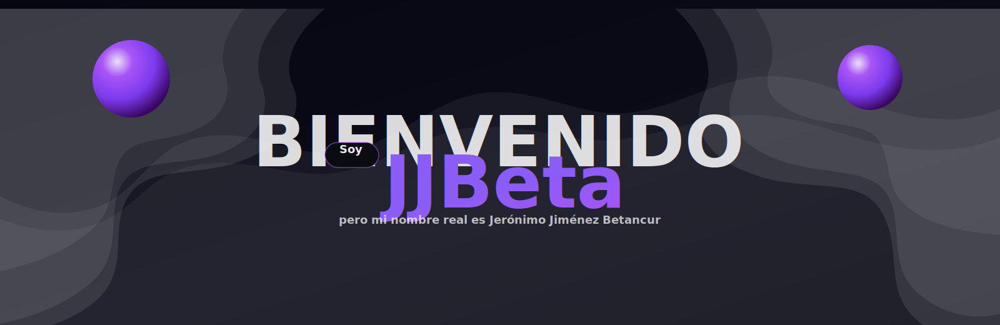

  

## BIENVENIDO

  <rect x="94" y="170" rx="16" ry="16" width="62" height="28" fill="#0B0B12" stroke="#A855F7" stroke-opacity="0.55"/>
  <text x="114" y="190" font-family="ui-sans-serif, system-ui" font-size="14" font-weight="800" fill="#E9D5FF">
    Soy
  </text>

  <text x="165" y="215" font-family="ui-sans-serif, system-ui" font-size="78" font-weight="950" fill="url(#p)">
    JJBeta
  </text>

  <text x="94" y="252" font-family="ui-sans-serif, system-ui" font-size="16" font-weight="650" fill="#FFFFFF" opacity="0.70">
    pero mi nombre real es Jerónimo Jiménez Betancur
  </text>

  <text x="94" y="280" font-family="ui-sans-serif, system-ui" font-size="13" font-weight="650" fill="#FFFFFF" opacity="0.46">
    Full-Stack · UI/UX · Suminagashi / Waves
  </text>
</svg>

 

<a href="https://tudominio.com" style="color: #7C3AED">Portfolio</a> ·
<a href="https://github.com/tuusuario?tab=repositories" style="color: #7C3AED">Proyectos</a> ·
<a href="mailto:tuemail@dominio.com" style="color: #7C3AED">Contacto</a> ·
<a href="https://linkedin.com/in/tuusuario" style="color: #7C3AED">LinkedIn</a>

  

---

## Acerca de mí

Soy Jerónimo Jiménez Betancur (aka JJBeta). Construyo productos digitales con enfoque en claridad, estética premium y ejecución real.

- Velocidad y performance  
- Arquitectura limpia y escalable  
- UI/UX minimalista high-end (dark-mode)  
- Seguridad y buenas prácticas  
- Entrega continua sin dejar tareas abiertas  

Simple, premium y escalable. Siempre.

---

## Stack

  
  
  
  

---

## Tools

  
  
  
  
  
  
  
  
  

---

## Lo que hago

---

## Proyectos

- Prosperity Sphere  
  E-commerce y embudos de conversión optimizados.  
  Stack: React · Stripe

- Oráculo IA  
  Lecturas automáticas a partir de datos y prompts.  
  Stack: API · OpenAI

- Antigravity Lab  
  Experimentos visuales, motion y UI components.  
  Stack: React · CSS

---

## Contacto

Email: tuemail@dominio.com  
Web: https://tudominio.com  
LinkedIn: https://linkedin.com/in/tuusuario  
Instagram / Behance: https://instagram.com/tuusuario  

---

JJBeta · Dark-first · Purple minimalism · Waves everywhere

