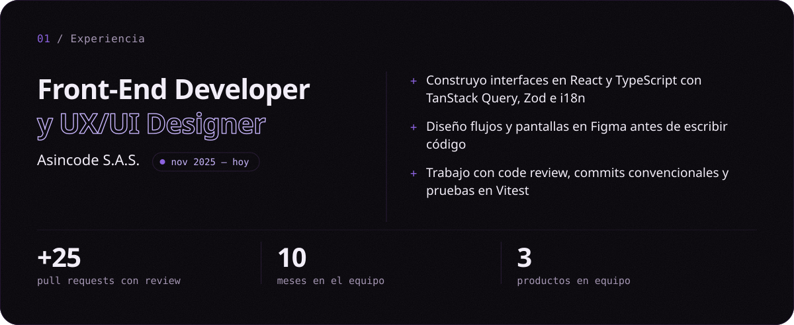
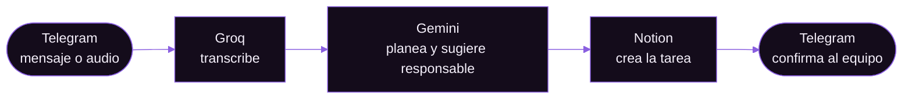

<!--
  Perfil de Jerónimo Jiménez Betancur (JJBeta).
  Los paneles salen de scripts/build-assets.mjs y el tablero de actividad
  se regenera cada día con .github/workflows/contributions.yml.
-->

<p align="center">
  
</p>

Soy **Jerónimo Jiménez Betancur**. No me gusta elegir entre que algo se vea bien o que funcione bien, así que hago las dos cosas: diseño la interfaz y la construyo, cuidando que sea accesible y que se sienta como una sola pieza.

<p align="center">
  
</p>

<p align="center">
  
</p>

<p align="center">
  
</p>

<p align="center">
  
</p>

<p align="center">
  
</p>

<p align="center">
  
</p>

<p align="center">
  
</p>

<p align="center">
  
</p>

<p align="center">
  <a href="mailto:jjbetacode@gmail.com"></a>
  &nbsp;
  <a href="https://www.linkedin.com/in/jjbeta"></a>
  &nbsp;
  <a href="https://www.instagram.com/jnz_jero/"></a>
</p>

<!-- texto:inicio -->
<details>
<summary><strong>Versión en texto</strong> · <code>README --no-images</code></summary>
<br>

```ts
// jjbeta.config.ts
export const jjbeta = {
  nombre: 'Jerónimo Jiménez Betancur',
  alias: 'JJBeta',
  rol: ['UX/UI Designer', 'Front-End Developer'],
  base: 'El Carmen de Viboral, CO',
  version: '19.0.0-beta', // el número de versión es mi edad
  principio: 'que todo se sienta como una sola pieza',
} as const
```

#### ¿Por qué JJBeta?

<kbd><b>J</b>erónimo</kbd> + <kbd><b>J</b>iménez</kbd> + <kbd><b>Beta</b>ncur</kbd> = **JJBeta**
<br><sub>Y también porque siempre estoy en beta.</sub>

#### Experiencia

> **Front-End Developer y UX/UI Designer** · [Asincode S.A.S.](https://asincode.co)
> <br>`nov 2025 → hoy` · 10 meses en el equipo

- Construyo interfaces en React y TypeScript con TanStack Query, Zod e i18n.
- Diseño flujos y pantallas en Figma antes de escribir código.
- Trabajo con code review, commits convencionales y pruebas en Vitest.
- **+20** pull requests con review en **2** productos del equipo.

#### Formación

**Técnica Laboral en Sistemas Informáticos** · Politécnico ASDI, Rionegro · 2025 – 2026

#### Automatizo lo repetitivo


```mermaid
%%{init: {'theme':'base','themeVariables':{'primaryColor':'#140C1B','primaryTextColor':'#F4EFFA','primaryBorderColor':'#8A5FE0','lineColor':'#8A5FE0','fontFamily':'ui-monospace, monospace'}}}%%
flowchart LR
  A([Telegram<br>mensaje o audio]) --> B[Groq<br>transcribe]
  B --> C[Gemini<br>planea y sugiere responsable]
  C --> D[Notion<br>crea la tarea]
  D --> E([Telegram<br>confirma al equipo])
```

<sub>Hecho en Make. También trabajo con n8n y modelos locales en Ollama.</sub>

#### Cómo trabajo

> **Si alguien no puede usarlo, no está terminado.**

| | Principio | En la práctica |
|:-:|:--|:--|
| `01` | **Accesible por defecto** | Contraste real, foco visible y todo usable con teclado. |
| `02` | **Semántica que se entiende** | HTML con sentido para lectores de pantalla y buscadores: el SEO empieza en el marcado. |
| `03` | **Una sola pieza** | Tokens compartidos y ritmo constante; cada sección conversa con la siguiente. |

#### Herramientas

| Área | Herramientas |
|:--|:--|
| **Diseño** | papel y lápiz → `Figma` · `Photoshop` |
| **Código** | `HTML` · `CSS` · `JavaScript` · `TypeScript` · `React` · `Tailwind CSS` |
| **Datos y forms** | `TanStack Query` · `Zustand` · `Zod` · `React Hook Form` |
| **Automatización** | `Make` · `n8n` · `Ollama` |
| **Flujo** | `Vite` · `Vitest` · `Git` · `Yaak` · `Zed` |

#### Changelog

```diff
@@ v19.0 · actual @@
+ Front-End y UX/UI en Asincode desde nov 2025
+ Interfaces en React y TypeScript con Tailwind CSS
+ Accesibilidad, semántica y SEO desde el primer commit

@@ v20.0 · en progreso @@
+ Next.js: App Router, Server Components y SSR
```

#### Contacto

```sh
$ jjbeta --contacto
> jjbetacode@gmail.com
> linkedin.com/in/jjbeta
> instagram.com/jnz_jero
```

[**Escríbeme**](mailto:jjbetacode@gmail.com) · [**LinkedIn**](https://www.linkedin.com/in/jjbeta) · [**Instagram**](https://www.instagram.com/jnz_jero/)

<sub>JJBeta · siempre en beta.</sub>

</details>
<!-- texto:fin -->
