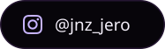

<!--
  Perfil de Jerónimo Jiménez Betancur (JJBeta).
  Los paneles salen de scripts/build-assets.mjs y el tablero de actividad
  se regenera cada día con .github/workflows/contributions.yml.
-->

  

Soy **Jerónimo Jiménez Betancur**, pero en código me conocen como **JJBeta**. Diseño interfaces en Figma y las construyo con React, TypeScript y Tailwind CSS, cuidando que sean accesibles, tengan una semántica que se entienda y se vean como una sola pieza, no como bloques pegados.

  

  

  

  

  

  

  
  &nbsp;
  

